# Medical RAG — Architecture

A production-grade medical document Q&A system built under hard constraints:
~4GB RAM ceiling, CPU-only inference, free-tier APIs only, no self-hosted
infrastructure. Every architectural decision below traces back to one of
these constraints.

## Pipeline Overview

```mermaid
graph LR
    PDF["📄 Source PDF<br/>/data/raw/"] --> Loader["Ingestion<br/>(PyMuPDF fitz)"]
    Loader --> Chunker["Chunking<br/>(MiniLM tokenizer-aware<br/>220-240 tokens)"]
    Chunker --> Embedder["Embedding<br/>(all-MiniLM-L6-v2)"]
    Embedder --> VectorStore["Vector Store<br/>(ChromaDB persistent)"]
    VectorStore --> VectorSearch["Vector Search"]
    VectorSearch --> HybridFusion["Hybrid Fusion<br/>(RRF, Phase 2)"]
    BM25["BM25 Index<br/>(bm25s, Phase 2)"] --> HybridFusion
    HybridFusion --> Reranker["Cross-Encoder Rerank<br/>(TinyBERT, Phase 2)"]
    Reranker --> LLM["LLM Generation<br/>(Groq API<br/>llama-3.3-70b)"]
    LLM --> CitationEnforcer["Citation Enforcement<br/>(max-over-sentences<br/>Phase 2)"]
    CitationEnforcer --> API["FastAPI Response<br/>answer + citations + status"]
```

## Phase Status

| Phase | Status | Description |
|-------|--------|-------------|
| 0 | ✅ Complete | Repo skeleton, config, types, logging, docs |
| 1 | ⬜ Pending | PDF ingest → chunk → embed → retrieve → cite |
| 2 | ⬜ Pending | Hybrid search, reranking, citation enforcement |
| 3 | ⬜ Pending | Golden dataset validation, RAGAS eval, CI |
| 4 | ⬜ Pending | Ops & maintenance guardrails |

## Key Constraints

- **RAM**: ~4GB ceiling. Docker daemon alone costs ~1.2GB — local dev uses uvicorn directly.
- **Embedding**: all-MiniLM-L6-v2 (256-token hard limit). Chunks sized at 220-240 tokens.
- **Vector DB**: ChromaDB persistent/embedded mode. No server-mode databases.
- **LLM**: Groq API (llama-3.3-70b-versatile). No local model weights.
- **Observability**: Langfuse Cloud only. No self-hosted Langfuse (Postgres + Docker = OOM).
- **Reranker**: TinyBERT (14MB), not MiniLM-L-6 (~250MB).
