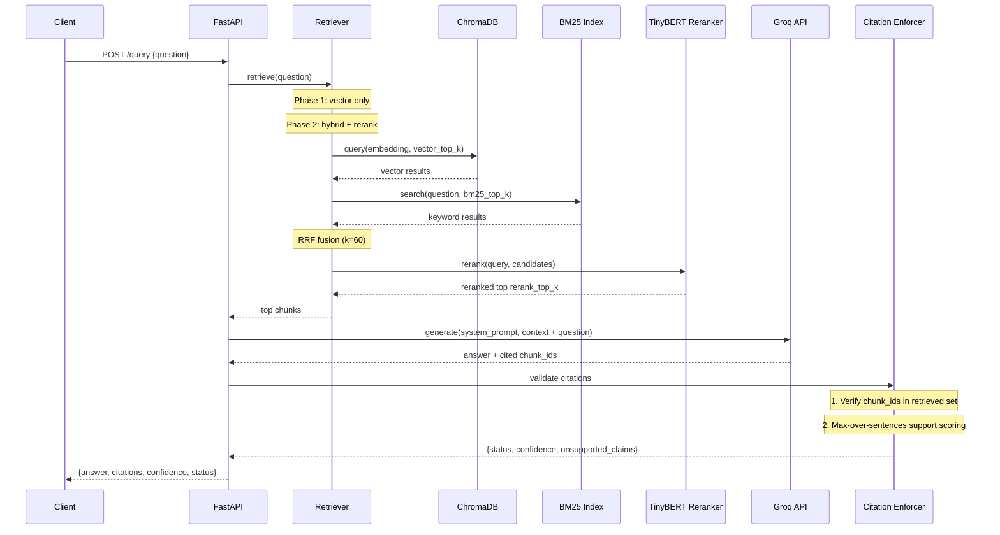

# Medical RAG — Query Sequence Diagram

## Endpoint Reference

| Endpoint | Method | Description |
|----------|--------|-------------|
| `/ingest` | POST | Ingest PDFs from /data/raw |
| `/query` | POST | Ask a question, get answer + citations |
| `/chunk/{chunk_id}` | GET | O(1) lookup of a specific chunk |
| `/health` | GET | Health check |
